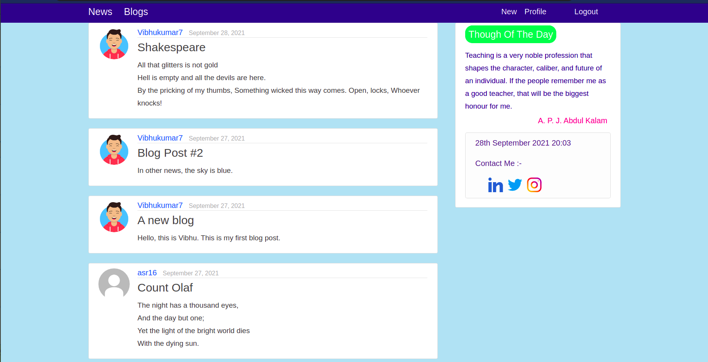
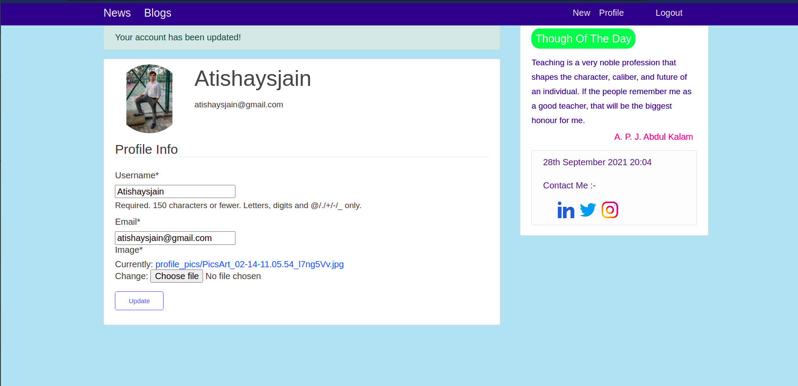

## News and Blog Web Application

## Demo 
* Linked to the deployed Heroku webapp :- https://news-blog-webapp.herokuapp.com/
* Link with demo of all functionalities of the webapp :- https://drive.google.com/file/d/1nIiDDZsOXCWMEb9r9JRhIc2HLaCdL8Ek/view?usp=sharing

## Overview
*  Authentication
    * User login, logout
    * User registration
    * Standard password validation
    * Forgot password validation
* API calls, JSON handling, Dashboard
    * Fetch and display News image, title in home page (after logging-in)
    * Filtering news on the basis of the publisher and category
    * Redirect user to detailed user article on clicking news clip image
    * User profile that a user can update with username, profile picture and email id
    * User creates blog-blog title, content, date created(automatic)
    * User delete and update his/her own blogs from dashboard
    * User can view blogs of other users
* Serializers - Django REST Framework
    * Site-administrator can view existing blogs list in json format through api endpoint only
    * Site-admin can delete, update, create blogs through api endpoints only
* Bootstrap
    * Necessary bootstrap is used

## Screenshots 📷
 <p float="left">
      
   
    
 </p>

## Getting Started
- Clone this repository
   ```Shell
   git clone git@github.com:Atishaysjain/News-Blog-Webapp.git;
   ```
   
- Create a virtual environment
  ```Shell
   virtualenv venev_name -p python3.8
   source ./venev_name/bin/activate
   pip install -r requirements.txt
  ```

## Adding your secret key, email and password (Ubuntu)

- Go to your home directory
   ```Shell
   cd ~
   ```

- Edit the .bashrc file
   ```Shell
   nano .bashrc
   ```

* Add the following code to your .bashrc file
    ```Shell
    export DJANGO_NEWS_BLOG_WEBAPP_SECRET_KEY="YOUR_SECRET_KEY" # Secret key 
    # This email will be used to send the link to reset password 
    export EMAIL_USER="YOUR_EMAIL_ID"
    export EMAIL_PASS="YOUR_EMAIL_PASSWORD"
    ```

